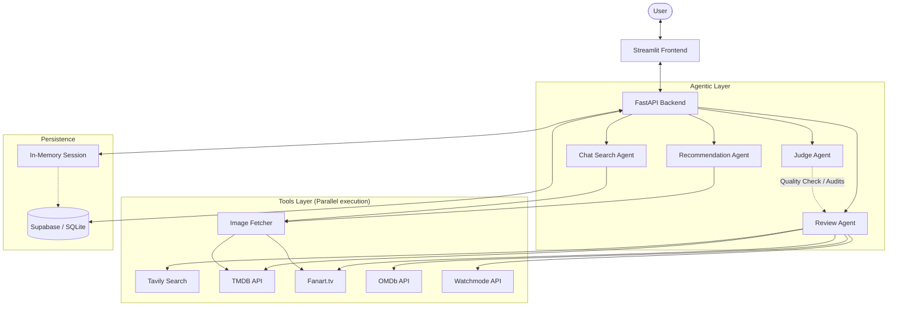

# Reelogue
> Your AI-powered cinema companion


Reelogue is a fully agentic application that acts as your personalized film critic and companion. By using conversational memory, massive-scale parallel searching, and LLM-as-judge self-correction, Reelogue curates and verifies the best cinema picks mapped directly to your specific tastes.

## Features
- **Personalised taste profiling:** Automatically translates user context into a reusable profile object.
- **AI recommendations with match scores:** Provides exact film match values based on your preferences.
- **Live review aggregation:** Gathers critical context concurrently across IMDb, Rotten Tomatoes, Metacritic, and Letterboxd.
- **AI-synthesised verdict:** Rewrites overwhelming amounts of reviews into clean, readable judgements.
- **LLM-as-Judge quality evaluation:** Self-checks AI verdicts against a 5-point rigorous rubric.
- **Streaming availability lookup:** Detects where the film can be currently watched.
- **Movie poster display:** Connects metadata pipelines to fetch stunning poster visuals, prioritized with high-quality sources from Fanart.tv.
- **Persistent storage:** Cloud-backed Supabase PostgreSQL database — watchlists, profiles, and reviews survive across refreshes, deploys, and devices.
- **Cross-device sessions:** Shareable session links let you access your data from any device.
- **Conversational search:** Ask Reelogue AI to find movies by director, actor, genre, or mood.

## Tech Stack

| Component | Tool / Tech | Purpose |
| --- | --- | --- |
| **Language** | Python | Primary backend scripting. |
| **UI** | Streamlit | Rapid interactive browser frontend prototyping. |
| **AI Brain (Generation)** | Groq Llama 3.1 | Primary LLM orchestrator executing logic and rapid JSON formatting. |
| **AI Brain (Evaluation)** | Gemini 2.5 Flash | LLM-as-Judge executing rigorous audits against the user profile. |
| **Search** | Tavily | Real-time scraper fetching web reviews across designated platforms. |
| **Movie Data** | TMDB | Metadata engine for basic film facts and posters. |
| **High-Res Posters** | Fanart.tv | Premium upscale posters for a better UI experience. |
| **Review Data** | OMDb | Fast baseline score fallback and API metrics. |
| **Streaming** | Watchmode API | Reliable lookup for streaming platforms globally. |
| **Database** | Supabase (PostgreSQL) | Cloud-persistent storage for profiles, watchlists, and reviews. |
| **Deployment** | Render + Streamlit Cloud | Backend API on Render, frontend on Streamlit Community Cloud. |

## System Architecture



## Project Structure
```
.
├── .env.example
├── .gitignore
├── PROBLEM_STATEMENT.md
├── README.md
├── TASK_DECOMPOSITION.md
├── supabase_setup.sql          # Run in Supabase SQL Editor to create tables
├── agents/
│   ├── __init__.py
│   ├── chat_search_agent.py    # Conversational movie search agent
│   ├── judge_agent.py
│   ├── onboarding_agent.py
│   ├── recommendation_agent.py
│   └── review_agent.py
├── api.py                      # FastAPI backend
├── main.py                     # CLI entry point
├── memory/
│   ├── __init__.py
│   ├── db.py                   # Dual-backend: Supabase (cloud) / SQLite (local)
│   └── user_profile.py
├── requirements.txt
├── streamlit_app.py            # Streamlit frontend
├── static/
└── tools/
    ├── __init__.py
    ├── omdb_fetch.py
    ├── tavily_search.py
    ├── tmdb_fetch.py
    └── watchmode_fetch.py
```

## Setup Instructions

1. **Clone the repo:**
   ```bash
   git clone https://github.com/yourusername/reelogue.git
   cd reelogue
   ```
2. **Install dependencies:**
   ```bash
   pip install -r requirements.txt
   ```
3. **Configure Environment:**
   Copy the example environment variables to a live `.env` file:
   ```bash
   cp .env.example .env
   ```
   *Fill the `.env` with your active keys based on the API list below.*

4. **Set up the Database:**
   - **For local development:** No setup needed — SQLite is used automatically.
   - **For production (Supabase):**
     1. Create a free project at [supabase.com](https://supabase.com)
     2. Go to **SQL Editor** → run the contents of `supabase_setup.sql`
     3. Copy your **Project URL** and **anon key** from **Settings → API**
     4. Add `SUPABASE_URL` and `SUPABASE_KEY` to your `.env` file

5. **Run the Application:**
   ```bash
   # Start the FastAPI backend
   uvicorn api:app --reload

   # In another terminal, start the Streamlit frontend
   streamlit run streamlit_app.py
   ```

## API Keys

| Key | Where to Get It | Free Tier Limits |
| --- | --- | --- |
| `GROQ_API_KEY` | [Groq Console](https://console.groq.com/keys) | 14,400 requests/day |
| `GEMINI_API_KEY` | [Google AI Studio](https://aistudio.google.com/) | 20 requests/sec |
| `TAVILY_API_KEY` | [Tavily Dashboard](https://tavily.com/) | 1,000 requests/month |
| `TMDB_API_KEY` | [TMDB Developer](https://developer.themoviedb.org/) | 50 requests/sec |
| `OMDB_API_KEY` | [OMDb API](http://www.omdbapi.com/apikey.aspx) | 1,000 requests/day |
| `WATCHMODE_API_KEY` | [Watchmode Settings](https://v2.watchmode.com/settings/) | 1,000 requests/month |
| `FANART_TV_API_KEY` | [Fanart.tv API](https://fanart.tv/get-an-api-key/) | Personal use / Free |
| `SUPABASE_URL` | [Supabase Dashboard](https://supabase.com) → Settings → API | Free (500 MB storage) |
| `SUPABASE_KEY` | [Supabase Dashboard](https://supabase.com) → Settings → API | (anon/public key) |

## How It Works

1. **Step 1: Your Taste Profile:** Users fill in their profile constraints, favorites, and disliked genres dynamically mapping into an active `UserProfile` object over the session.
2. **Step 2: Get My Picks:** The Recommendation Agent runs an AI analysis outputting five exact matches with personalized reasons.
3. **Step 3: Choose a film:** The user selects a specific result, activating a deeper context load.
4. **Step 4: Display the full review:** Parallel APIs execute simultaneously, rendering posters, synthesizing four domains of review content (Metacritic, IMDb, etc.), mapping Watchmode streaming metadata, and building a finalized, high-quality review screen.
5. **Step 5: LLM-as-Judge Evaluation:** The completely independent `Judge Agent` scans the generated content against the `UserProfile` dynamically and issues 5 distinct rubric validations ensuring accuracy, source coverage, and reasoning reliability.

## LLM-as-Judge

The internal verification step forces Gemini to behave as an auditor over its own multi-agent process, judging content on a 1-5 scale across:
- **Review Accuracy:** Evaluates aggregated metric mapping.
- **Recommendation Relevance:** Evaluates structural connections against user tastes.
- **Synthesis Quality:** Prevents generic output summaries.
- **Source Coverage:** Determines scrape efficacy.
- **Personalisation Depth:** Audits custom taste connection formatting.

## Deployment

**Backend (Render):**
1. Connect your GitHub repo to [Render](https://render.com)
2. Set **Build Command:** `pip install -r requirements.txt`
3. Set **Start Command:** `uvicorn api:app --host 0.0.0.0 --port $PORT`
4. Add all environment variables (API keys + `SUPABASE_URL` + `SUPABASE_KEY`)

**Frontend (Streamlit Community Cloud):**
1. Link your GitHub repo at [share.streamlit.io](https://share.streamlit.io)
2. Set main file to `streamlit_app.py`
3. Add secrets: all API keys + `SUPABASE_URL`, `SUPABASE_KEY`, `API_URL` (your Render URL), `STREAMLIT_URL`

**Database (Supabase):**
1. Create a free project at [supabase.com](https://supabase.com)
2. Run `supabase_setup.sql` in the SQL Editor
3. Use the Project URL and anon key as env vars above

## Live Demo
- **Live app:** [https://reelogue-ai.streamlit.app/]
- **Demo video:** [https://www.loom.com/share/50d93948355f483987fdf5ace5a222b1?t=201]

## Team
- **Role A (Architect & Integrator):** Project framework and API management.
- **Role B (Builder & Deployer):** Feature construction and delivery workflow. 

## License
MIT License
